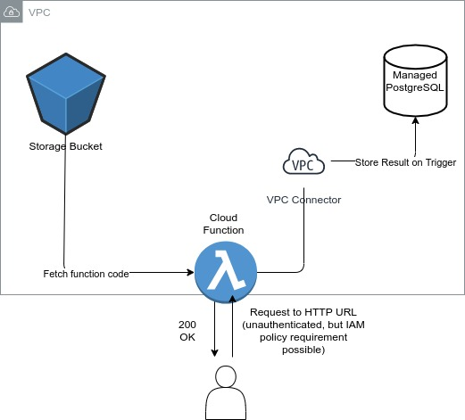

# EMBank Devops Tech Challenge PART 2

## Requirement
Create Cloud Function(or AWS Lambda)that lists all VPCs and Subnets in the project(or account)and saves the data in the database(you can choose the database as well as the format in which you want to save the data)

## Architecture


Repository contains a Terraform module which creates the following resources:
1. Enables Service APIs required to run this code for a project
2. Google Cloud Service Account
3. VPC Network
4. Serverless VPC Connector
5. Storage Bucket
6. Managed PostgresSQL Database with DB user
7. Cloud function itself

## How to run

1. Edit as desired function source code (**src** folder) and create a deployment bundle out of it as follows:

```
zip -j out/cloud_fn.zip src/*
```

NB: Make sure the **out** folder exists, create it in repository root if it does not

2. Make sure you are logged in your GCloud project (gcloud auth login). Edit provider info file, so it points to authenticated project (**terraform/provider.vars.tf**)

3. Create tfvars file or use environment variables to set secret variables needed for execution

```
export TF_VAR_db_username=admin TF_VAR_db_password=somepass
```
4. Navigate to terraform folder and run:

```terraform apply```


## TODOs and improvements

Note that this code is close to PoC and can be improved in several ways, e.g.:

* Since Google Cloud functions use Flask internally - utilize Flask's **before_first_request** decorator to check if DB table exists and create it
* Use bulk insert for networks in DB, instead of inserting them iteratively
* Better logic separation and code organization, documentation (applies to Terraform variables, not only Python code)
* Extract more important networks' parameters - IPv4CIDR, Firewall rules, etc.
